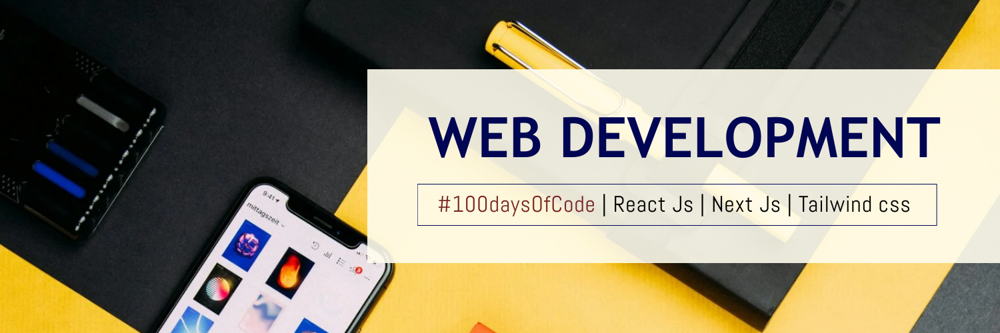

<h1 align="center" style="font-size: 68px;">Hi 👋, I'm Anuj Kumar</h1>
<h3 align="center" style="font-size: 46px;">I'm a passionate web developer and app developer interested in creating awesome applications</h3>

  

  

- 🔭 I’m currently working on **HopesAlive which is an animal rescue platform integrated with DocuSign for E-sign for onboarding NGO's and Volunteer**

- 🌱 I’m currently learning : **Next.js, along with a bit of backend development using Node.js and Express**

- 💬 Ask me about : **ReactJs,Supabase,Nextjs,Nodejs,API,ReactNative**

- 📫 How to reach me : **anuj846k@gmail.com**

- ⚡ Fun fact : **I thrive in focused, goal-oriented environments and am driven by meaningful, impactful work.**

- ## #30NitesOfCode:
  [Check out my progress!](https://www.codedex.io/@anuj846k70317/30-nites-of-code)  
  

<h3 align="left">Connect with me:</h3>

<h3 align="left">Languages and Tools:</h3>

                     

## Holopin badges👀

